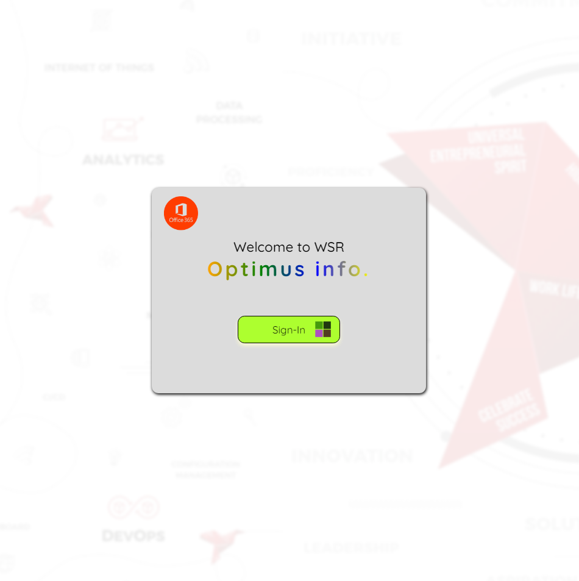

# WSR Login Page

## This is a React app that uses MSAL.js to implement a login page for the WSR service.

**Prerequisites**

Node.js >= 16.13.0
React >= 17.0.0
MSAL.js >= 2.0.0

**Installation**

### Clone this repository:

git clone https://github.com/rahulm-optimus/sample_wsr_loginpage.git

### Install the dependencies:

npm install
Usage

### Start the development server:
npm start
Open your browser and go to http://localhost:3000

**Configuration**
The MSAL.js configuration is defined in the src/msalConfig.json file. You can update the following values:

#### clientId: The ID of your Azure AD application.
#### tenantId: The ID of your Azure AD tenant.
#### authRedirectUrl: The URL to which users will be redirected after successful authentication.

**MSAL.js integration**

The MSAL.js integration is implemented in the src/index.js . It must be initiated before DOM tree to avoid from re-initiated on every render cycle

**Login flow**

When a user clicks the Sign-in button, the following steps are performed:
The LoginButton component redirects the user to the Azure AD login page.
The user enters their credentials and logs in.
Azure AD redirects the user back to the WSR login page with an access token.
The LoginButton component validates the access token and logs the user in.
Signout flow
To sign out, the user can click the signout button in the header. This will redirect the user to the Azure AD logout page, where they will be logged out.

### Deployment

Once you are ready to deploy your app, you can build it for production:

npm run build

This will create a production build of your app in the build directory. You can then deploy this build to your hosting provider.